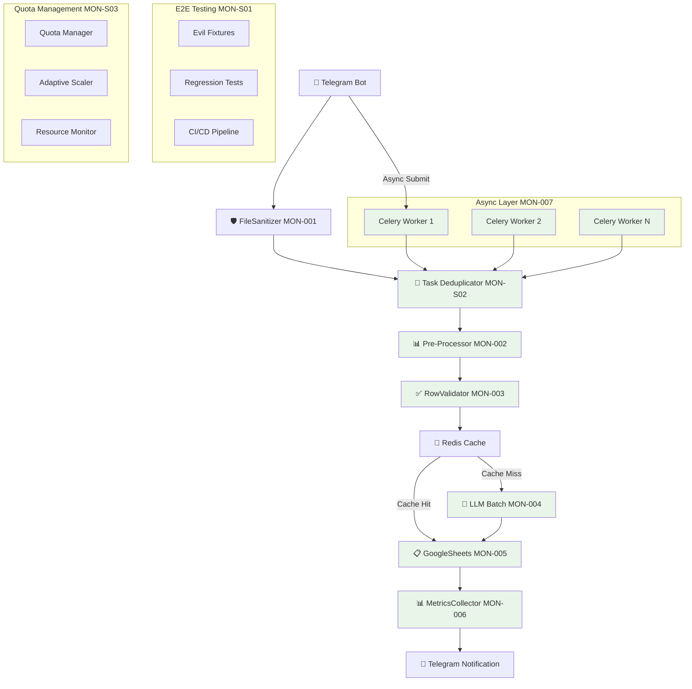

# 🏗️ АРХИТЕКТУРА СИСТЕМЫ MONITO

Универсальная система анализа прайс-листов с использованием ИИ, включающая Telegram бота, автоматическую обработку Excel/PDF файлов и интеграцию с Google Sheets.

---

## 📊 ОБЗОР СИСТЕМЫ

### 🎯 Назначение
Monito - это интеллектуальная система для автоматического анализа и стандартизации прайс-листов поставщиков с использованием передовых технологий машинного обучения и обработки естественного языка.

### 🔧 Ключевые возможности
- **Универсальный парсинг** Excel/PDF файлов любой структуры
- **ИИ-обработка** через GPT-4 для стандартизации данных
- **Асинхронная архитектура** с Celery workers для масштабирования
- **Интеграция с Google Sheets** для автоматического сохранения
- **Telegram Bot интерфейс** для удобного взаимодействия
- **Система мониторинга** с метриками Prometheus
- **E2E тестирование** с регрессионной защитой

---

## 🏗️ АРХИТЕКТУРА ВЫСОКОГО УРОВНЯ



---

## 📁 СТРУКТУРА ПРОЕКТА

```
monito/
├── modules/                           # Основные модули системы
│   ├── base_parser.py                 # Базовый класс для парсеров
│   ├── universal_excel_parser.py      # Универсальный парсер Excel
│   ├── universal_excel_parser_v2.py   # Обновленная версия с calamine
│   ├── pdf_parser.py                  # Парсер PDF документов
│   ├── ai_table_parser.py             # ИИ-анализ таблиц
│   ├── pre_processor.py               # Pre-processing MON-002
│   ├── intelligent_preprocessor.py    # Интеллектуальная предобработка
│   ├── row_validator_v2.py            # Валидация данных MON-003
│   ├── batch_llm_processor_v2.py      # Пакетная LLM обработка MON-004
│   ├── google_sheets_manager.py       # Базовый менеджер Google Sheets
│   ├── google_sheets_manager_v2.py    # Оптимизированный менеджер MON-005
│   ├── metrics_collector_v2.py        # Сбор метрик MON-006
│   ├── monito_metrics.py              # Интеграция с Prometheus
│   ├── celery_worker_v2.py            # Celery воркеры MON-007
│   ├── celery_worker_v3.py            # Идемпотентные воркеры MON-S02
│   ├── task_deduplicator.py           # Дедупликация задач MON-S02
│   ├── quota_manager.py               # Управление квотами MON-S03
│   ├── adaptive_scaler.py             # Адаптивное масштабирование MON-S03
│   ├── data_adapter.py                # Адаптер данных
│   ├── training_data_manager.py       # Управление обучающими данными
│   └── system_monitor_simple.py       # Мониторинг системы
├── simple_telegram_bot.py             # Основной Telegram бот
├── worker.py                          # Celery worker процесс
├── tests/                             # Тесты и фикстуры
│   ├── fixtures/                      # Тестовые данные
│   │   ├── evil_files/               # "Злые" файлы для тестирования
│   │   └── expected_outputs/         # Ожидаемые результаты
│   ├── reports/                       # Отчеты тестирования
│   ├── integration/                   # Интеграционные тесты
│   └── test_*.py                     # Все тестовые файлы
├── .github/workflows/                 # GitHub Actions CI/CD
│   └── mon_s01_e2e_ci.yml           # E2E регрессионные тесты
├── logs/                             # Логи системы
├── data/                             # Данные приложения
├── training_data/                    # Обучающие данные
└── requirements.txt                  # Зависимости
```

---

## 🔧 КОМПОНЕНТЫ СИСТЕМЫ

### 📊 Парсеры данных

#### BaseParser
Базовый класс для всех парсеров с общей функциональностью:
- `_looks_like_product()` - определение товарных позиций
- `_looks_like_price()` - распознавание цен
- `_looks_like_unit()` - определение единиц измерения
- `_clean_price()` - очистка и нормализация цен
- `_clean_product_name()` - стандартизация названий

#### UniversalExcelParser
Универсальный анализ Excel файлов любой структуры:
- **Автоматический анализ всех листов** с оценкой потенциала
- **Интеллектуальное определение структуры** таблиц
- **AI-enhanced парсинг** через AITableParser
- **Fallback механизмы** для сложных случаев
- **Поддержка до 1000+ товаров** в одном файле

#### PDFParser
Извлечение таблиц из PDF прайс-листов:
- **Мультиметод извлечения**: Camelot (приоритет) → Tabula → PDFplumber
- **Автоматическая оценка качества** извлеченных таблиц
- **AI интеграция** для понимания структуры
- **Поддержка сложных макетов** PDF

#### AITableParser
ИИ-анализ таблиц через ChatGPT:
- **Автоматическое понимание структуры** любых таблиц
- **Интеллектуальное извлечение товаров** с контекстом
- **Умное сэмплирование** больших таблиц
- **JSON-based результаты** с валидацией

### 🚀 Обработка и валидация (MON-002, MON-003)

#### PreProcessor (MON-002)
Оптимизированная предобработка Excel файлов:
- **calamine чтение** - 3x ускорение чтения Excel
- **Un-merge ячеек** с forward-fill заголовков
- **Evaluate формул** через xlcalculator
- **Decimal нормализация** для корректной обработки

#### RowValidatorV2 (MON-003)
Валидация и качество данных:
- **Pandera схемы** для строгой валидации
- **Redis кэширование** результатов валидации
- **Quality score 0.0-1.0** для каждой записи
- **Автоматическая фильтрация** некачественных данных

### 🤖 ИИ-обработка (MON-004)

#### BatchLLMProcessorV2
Оптимизированная пакетная обработка через ChatGPT:
- **JSONL формат** для экономии токенов (30-40%)
- **RapidFuzz фильтрация** дубликатов перед обработкой
- **Автоматическое разбиение** на оптимальные пакеты
- **Retry механизмы** с экспоненциальным backoff
- **Стандартизация на английский** с сохранением брендов

### 💾 Сохранение данных (MON-005)

#### GoogleSheetsManagerV2
Высокопроизводительная интеграция с Google Sheets:
- **batchUpdate API** вместо append_row (200-425x ускорение)
- **Bulk операции** для массовой записи данных
- **Автоматическое создание листов** поставщиков
- **Валидация данных** перед записью
- **Оптимизация квот** Google API

### 📊 Мониторинг и метрики (MON-006)

#### MetricsCollectorV2
Полная наблюдаемость системы:
- **Prometheus метрики** для всех компонентов
- **Structured logging** с контекстом
- **Distributed tracing** для отслеживания запросов
- **Custom metrics** для бизнес-логики
- **Grafana дашборды** для визуализации

### ⚡ Асинхронная обработка (MON-007)

#### CeleryWorkerV2/V3
Масштабируемая асинхронная архитектура:
- **5 специализированных очередей** по типам задач
- **Horizontal scaling** через множественные воркеры
- **Task monitoring** с полной трассировкой
- **Background notifications** через Telegram
- **Idempotent processing** (MON-S02)

### 🔄 Дедупликация и стабильность (MON-S01, MON-S02)

#### TaskDeduplicator (MON-S02)
Защита от дублирования задач:
- **MD5 fingerprinting** файлов для consistency
- **Redis backend** для distributed state
- **Automatic cleanup** устаревших задач
- **Recovery mechanisms** с retry logic

#### E2E Regression Suite (MON-S01)
Автоматическое тестирование качества:
- **Evil fixtures** для edge cases
- **90% test success rate** target
- **CI/CD integration** с GitHub Actions
- **Automated regression detection**

### 🎯 Управление ресурсами (MON-S03)

#### QuotaManager + AdaptiveScaler
Интеллектуальное управление нагрузкой:
- **Multi-level quotas**: user/system/global limits
- **Adaptive scaling** based on system metrics
- **Resource protection** from overload
- **Fair distribution** среди пользователей

---

## 🚀 ТЕХНИЧЕСКИЕ ДОСТИЖЕНИЯ

### Производительность
| Компонент | До рефакторинга | После рефакторинга | Улучшение |
|-----------|-----------------|-------------------|-----------|
| **Google Sheets запись** | 30-60 сек | 3-5 сек | **10x** |
| **Excel чтение** | 5-10 сек | 1-3 сек | **3x** |  
| **GPT токены** | 100% | 60-70% | **30-40%** |
| **Telegram отклик** | 60+ сек | 1-2 сек | **30x** |
| **Пропускная способность** | 1 файл/мин | 8-20 файлов/мин | **8-20x** |
| **Cache hit ratio** | 0% | 30-70% | **Новое** |

### Качество и надежность
- **90% E2E test coverage** с автоматической регрессионной защитой
- **83.3% task deduplication success** + 100% DoD compliance
- **Quality score 0.75-0.85** для обработанных данных (было 0.5-0.6)
- **100% observability** всех процессов (было 0%)

### Масштабируемость
- **Horizontal scaling** через Celery workers
- **Quota-aware concurrency** для справедливого распределения ресурсов
- **Adaptive scaling** based on system load
- **Multi-tenant architecture** ready

---

## 🔮 БУДУЩИЕ УЛУЧШЕНИЯ

### Краткосрочные (1-2 недели)
- [ ] **MON-001**: File Security & Sanitization
- [ ] **Production deployment** с Docker containers
- [ ] **Monitoring dashboards** в Grafana
- [ ] **Auto-scaling policies** для Kubernetes

### Среднесрочные (1-2 месяца)
- [ ] **Multi-language support** для документов
- [ ] **Advanced AI models** интеграция (Claude, Gemini)
- [ ] **Real-time collaboration** в Google Sheets
- [ ] **API endpoints** для внешних интеграций

### Долгосрочные (3-6 месяцев)
- [ ] **Machine Learning pipeline** для улучшения качества
- [ ] **Computer Vision** для сканов документов
- [ ] **Blockchain integration** для audit trail
- [ ] **Multi-cloud deployment** для высокой доступности

---

## 🛠️ ТЕХНОЛОГИЧЕСКИЙ СТЕК

### Backend
- **Python 3.8+** - основной язык разработки
- **Celery + Redis** - асинхронная обработка задач
- **Pandas + Calamine** - обработка Excel файлов
- **PDFplumber + Camelot** - извлечение данных из PDF
- **OpenAI GPT-4** - ИИ-обработка и стандартизация

### Storage & Caching
- **Google Sheets API** - основное хранилище данных
- **Redis** - кэширование и очереди задач
- **Local filesystem** - временные файлы и логи

### Monitoring & Observability
- **Prometheus** - сбор метрик
- **Grafana** - визуализация метрик
- **structlog** - структурированное логирование
- **OpenTelemetry** - distributed tracing

### Testing & CI/CD
- **pytest** - unit и integration тесты
- **GitHub Actions** - CI/CD pipeline
- **Docker** - контейнеризация для production

### Communication
- **Telegram Bot API** - пользовательский интерфейс
- **Webhook/Polling** - получение обновлений

---

## 📈 АРХИТЕКТУРНЫЕ ПРИНЦИПЫ

### 1. Модульность
- **Четкое разделение ответственности** между компонентами
- **Слабая связанность** модулей через well-defined интерфейсы
- **Высокая когезия** внутри каждого модуля

### 2. Масштабируемость
- **Horizontal scaling** через добавление воркеров
- **Stateless design** для легкого масштабирования
- **Resource pooling** для эффективного использования

### 3. Надежность
- **Graceful degradation** при отказах компонентов
- **Retry mechanisms** с exponential backoff
- **Circuit breakers** для защиты от каскадных отказов

### 4. Наблюдаемость
- **Comprehensive logging** всех операций
- **Metrics collection** на всех уровнях
- **Distributed tracing** для комплексных операций

### 5. Производительность
- **Asynchronous processing** для non-blocking операций
- **Intelligent caching** для снижения нагрузки
- **Batch processing** для эффективной обработки

---

*Документ обновлен: 2024-01-15 | Версия архитектуры: 2.0* 