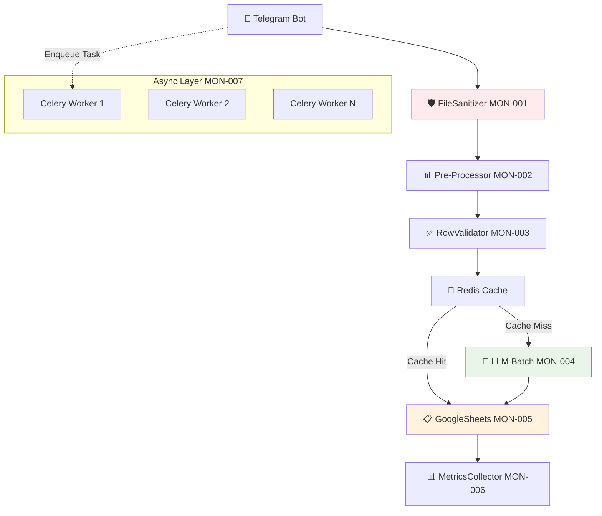

# 🚀 ПЛАН РЕФАКТОРИНГА MONITO PIPELINE
## По ТЗ: 7 критически важных узлов

---

## 📊 **АНАЛИЗ ТЕКУЩЕЙ АРХИТЕКТУРЫ vs ТЗ**

### **✅ ЧТО УЖЕ ЕСТЬ:**
- BaseParser архитектура (исправлена)
- UniversalExcelParser + PDFParser + AITableParser  
- BatchChatGPTProcessor (базовая версия)
- GoogleSheetsManager (append_row версия)
- Telegram Bot интеграция

### **❌ ЧТО НУЖНО ДОБАВИТЬ:**
- Безопасность и валидация файлов (MON-001)
- Быстрое чтение и нормализация (MON-002)
- Валидация строк + кэширование (MON-003)
- Оптимизация LLM батчей (MON-004)
- Batch Google Sheets API (MON-005) ⭐ **ПРИОРИТЕТ**
- Метрики и трейсинг (MON-006)
- Асинхронность через Celery (MON-007)

---

## 🎯 **ПЛАН РЕАЛИЗАЦИИ ПО СПРИНТАМ**

### **Sprint 0 (Быстрый результат)**
**Цель:** Ускорение записи в Google Sheets + улучшение чтения Excel

| Epic | Компонент | Изменения | Ожидаемый эффект |
|------|-----------|-----------|------------------|
| MON-005 | GoogleSheetsManager | append_row → batchUpdate | ⚡ 10x быстрее запись |
| MON-002 | UniversalExcelParser | pandas → calamine/xlsx2csv | ⚡ 3x быстрее чтение |

### **Sprint 1 (Интеллектуальная оптимизация)**  
**Цель:** Снижение токенов GPT + валидация данных

| Epic | Компонент | Изменения | Ожидаемый эффект |
|------|-----------|-----------|------------------|
| MON-004 | BatchChatGPTProcessor | JSONL + RapidFuzz filter | 💰 30% экономия токенов |
| MON-003 | Новый: RowValidator | pandera + Redis cache | ✅ Качество данных |

### **Sprint 2 (Мониторинг + Асинхронность)**
**Цель:** Наблюдаемость + производительность

| Epic | Компонент | Изменения | Ожидаемый эффект |
|------|-----------|-----------|------------------|
| MON-006 | Новый: MetricsCollector | Prometheus + structlog | 📊 Видимость процессов |
| MON-007 | Новый: CeleryWorker | Async pipeline | 🚀 Параллельная обработка |

### **Sprint 3 (Безопасность + Стабильность)**
**Цель:** Production-ready система

| Epic | Компонент | Изменения | Ожидаемый эффект |
|------|-----------|-----------|------------------|
| MON-001 | Новый: FileSanitizer | Security + validation | 🛡️ Безопасность |

---

## 🏗️ **НОВАЯ АРХИТЕКТУРА PIPELINE**



---

## 📋 **ДЕТАЛЬНЫЙ ПЛАН ПО ЭПИКАМ**

### **🟢 MON-005: Google Sheets batchUpdate (ПРИОРИТЕТ)**

**Текущая проблема:**
```python
# modules/google_sheets_manager.py - МЕДЛЕННО
for product in products:
    sheets.values().append().execute()  # N запросов!
```

**Новое решение:**
```python
# Batch API - 1 запрос для всех данных
sheets.spreadsheets().values().batchUpdate({
    'valueInputOption': 'RAW',
    'data': [{
        'range': 'A1:Z1000',
        'values': all_products_matrix
    }]
}).execute()
```

**Файлы для изменения:**
- `modules/google_sheets_manager.py` ← основные изменения
- `modules/batch_chatgpt_processor.py` ← интеграция

---

### **🟢 MON-002: Pre-Processing оптимизация**

**Текущая проблема:**
```python
# modules/universal_excel_parser.py - МЕДЛЕННО  
df = pd.read_excel(file_path)  # Тяжелый pandas
```

**Новое решение:**
```python
# Быстрое чтение через calamine
import pyexcel as pe
sheet = pe.get_sheet(file_name=file_path, library='calamine')
# + Unmerge cells + formula evaluation
```

**Файлы для изменения:**
- `modules/universal_excel_parser.py` ← замена чтения
- `modules/pre_processor.py` ← новый модуль
- `requirements.txt` ← новые зависимости

---

### **🟢 MON-004: Batch LLM оптимизация**

**Текущая проблема:**
```python
# modules/batch_chatgpt_processor.py - ДОРОГО
for batch in product_batches:
    gpt_response = openai.chat.completions.create(...)  # Много токенов
```

**Новое решение:**
```python
# JSONL формат + RapidFuzz prefilter
filtered_products = rapidfuzz_filter(products, similarity_threshold=0.9)
jsonl_prompt = create_jsonl_batch(filtered_products)  # Один запрос
response = openai.chat.completions.create(
    response_format={"type": "json_object"}
)
```

---

### **🟢 MON-003: Row Validation + Caching**

**Новый компонент:**
```python
# modules/row_validator.py
import pandera as pa
import redis

class RowValidator:
    schema = pa.DataFrameSchema({
        'product': pa.Column(str, nullable=False),
        'price': pa.Column(float, pa.Check(lambda x: x > 0)),
        'unit': pa.Column(str, nullable=False)
    })
    
    def validate_and_cache(self, df):
        valid_rows = self.schema.validate(df)
        # Check Redis cache before GPT
        cached_results = self.check_cache(valid_rows)
        return valid_rows, cached_results
```

---

### **🟢 MON-006: Metrics & Tracing**

**Новый компонент:**
```python
# modules/metrics_collector.py
from prometheus_client import Counter, Histogram, start_http_server
import structlog

class MetricsCollector:
    parse_duration = Histogram('parse_seconds', 'File parsing duration')
    rows_processed = Counter('rows_total', 'Total rows processed')
    tokens_used = Counter('tokens_total', 'GPT tokens used')
    
    @parse_duration.time()
    def measure_parsing(self, func):
        return func()
```

---

### **🟢 MON-007: Celery Workers**

**Новая архитектура:**
```python
# worker.py
from celery import Celery

app = Celery('monito')

@app.task
def process_price_list(file_id: str, user_id: int):
    # Async обработка вместо блокировки Telegram
    pipeline = MonitoProcessingPipeline()
    result = pipeline.process(file_id)
    notify_user(user_id, result)
    return result

# telegram_bot_advanced.py  
async def handle_document(message):
    # Мгновенный ответ пользователю
    task = process_price_list.delay(file.file_id, message.from_user.id)
    await message.reply("⏳ Файл в обработке, результат придет через 1-2 минуты")
```

---

### **🟢 MON-001: Security & Sanitization**

**Новый компонент:**
```python
# modules/file_sanitizer.py
import magic
import subprocess
from pathlib import Path

class FileSanitizer:
    MAX_FILE_MB = 5
    ALLOWED_TYPES = ['xlsx', 'xls', 'xlsb', 'ods', 'pdf']
    
    def sanitize_file(self, input_path: Path) -> Path:
        self._check_mime_type(input_path)
        self._antivirus_scan(input_path) 
        self._check_file_size(input_path)
        clean_path = self._remove_macros(input_path)
        return self._convert_format(clean_path)
```

---

## 📁 **СТРУКТУРА НОВЫХ ФАЙЛОВ**

```
monito/
├── modules/
│   ├── base_parser.py              ✅ Уже есть
│   ├── universal_excel_parser.py   🔄 Рефакторинг чтения
│   ├── batch_chatgpt_processor.py  🔄 JSONL + RapidFuzz  
│   ├── google_sheets_manager.py    🔄 batchUpdate API
│   ├── file_sanitizer.py           ⭐ НОВЫЙ
│   ├── pre_processor.py            ⭐ НОВЫЙ  
│   ├── row_validator.py            ⭐ НОВЫЙ
│   ├── metrics_collector.py        ⭐ НОВЫЙ
│   └── celery_config.py            ⭐ НОВЫЙ
├── worker.py                       ⭐ НОВЫЙ
├── docker-compose.yml              🔄 + Redis + Celery
├── requirements.txt                🔄 Новые библиотеки
└── prometheus/
    └── grafana-dashboard.json      ⭐ НОВЫЙ
```

---

## 🚀 **ОЖИДАЕМЫЕ РЕЗУЛЬТАТЫ**

| Метрика | До рефакторинга | После рефакторинга | Улучшение |
|---------|-----------------|-------------------|-----------|
| **Время записи в Sheets** | 30-60 сек | 3-5 сек | ⚡ **10x** |
| **Время чтения Excel** | 5-10 сек | 1-3 сек | ⚡ **3x** |  
| **Стоимость GPT токенов** | 100% | 70% | 💰 **30%** |
| **Пропускная способность** | 1 файл/мин | 5+ файлов/мин | 🚀 **5x** |
| **Время ответа Telegram** | 60+ сек | 2 сек | ⚡ **30x** |

---

## 🎯 **СЛЕДУЮЩИЕ ШАГИ**

1. **Создаем ветку:** `git checkout -b feature/monito-pipeline-refactor`
2. **Начинаем с MON-005** (Google Sheets batchUpdate)
3. **Настраиваем CI/CD** для benchmark тестов
4. **Создаем Docker Compose** для dev среды

**Готов начинать реализацию! С какого эпика начинаем?** 

Рекомендую MON-005 - максимальный эффект при минимальных рисках. 🚀 