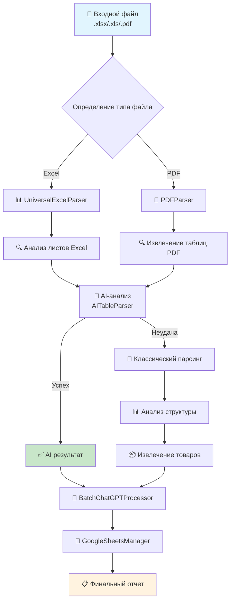

# 🚀 ТЕКУЩАЯ АРХИТЕКТУРА PIPELINE 
## После устранения дублирований и нестыковок

---

## 📋 **ОБЗОР PIPELINE**



---

## 🏗️ **АРХИТЕКТУРА КЛАССОВ**

### **Базовая архитектура (НОВАЯ)**
```
BaseParser ⭐ НОВЫЙ БАЗОВЫЙ КЛАСС
├── 🔧 _looks_like_product()
├── 🔧 _looks_like_price()  
├── 🔧 _looks_like_unit()
├── 🔧 _clean_price()
├── 🔧 _clean_product_name()
├── 📊 product_patterns[]
├── 📊 price_patterns[]
└── 📊 common_units[]
```

### **Парсеры (ИСПРАВЛЕННЫЕ)**
```
UniversalExcelParser(BaseParser) ✅
├── [наследует все базовые функции]
├── 📋 extract_products_universal()
├── 🔍 _analyze_all_sheets()
├── 📊 _analyze_data_structure()
├── 🎯 _extract_products_by_structure()
└── 🤖 _try_ai_extraction()

PDFParser(BaseParser) ✅  
├── [наследует все базовые функции]
├── 📄 extract_products_from_pdf()
├── 🔧 _extract_tables_multi_method()
├── 📊 _calculate_table_quality()
└── 🤖 _try_ai_extraction()

AITableParser(BaseParser) ✅
├── [наследует все базовые функции]
├── 🤖 analyze_table_structure()
├── 📝 _create_analysis_prompt()
├── 🌐 _query_chatgpt()
└── 📊 extract_products_with_ai()
```

---

## 🔄 **ПРОЦЕСС ОБРАБОТКИ**

### **1. 📁 ВХОДНАЯ ТОЧКА**
```python
# Telegram Bot получает файл
telegram_bot_advanced.py 
  ↓
  🔍 Валидация файла
  ↓
  📊 Определение типа (.xlsx/.pdf)
```

### **2. 📊 ПАРСИНГ ФАЙЛА**
```python
# Для Excel файлов
UniversalExcelParser.extract_products_universal()
  ↓
  📋 Анализ всех листов
  ↓
  🏆 Выбор лучшего листа
  ↓
  🤖 Попытка AI-анализа (AITableParser)
  ↓
  🔧 Fallback: классический парсинг

# Для PDF файлов  
PDFParser.extract_products_from_pdf()
  ↓
  📄 Извлечение таблиц (Camelot/Tabula/PDFplumber)
  ↓
  🏆 Выбор лучшей таблицы
  ↓
  🤖 Попытка AI-анализа (AITableParser)
  ↓
  🔧 Fallback: использование UniversalExcelParser
```

### **3. 🧠 ОБРАБОТКА ДАННЫХ**
```python
# Стандартизация через ChatGPT
BatchChatGPTProcessor.process_all_products()
  ↓
  📦 Разбиение на пакеты
  ↓
  🤖 Обработка через GPT-4
  ↓
  ✅ Стандартизированные данные
```

### **4. 💾 СОХРАНЕНИЕ**
```python
# Сохранение в Google Sheets
GoogleSheetsManager.update_master_table()
  ↓
  ✅ Валидация данных
  ↓
  📊 Создание/обновление таблицы
  ↓
  📋 Создание листа поставщика
```

---

## 🔧 **КЛЮЧЕВЫЕ КОМПОНЕНТЫ**

### **📊 UniversalExcelParser**
- **Назначение:** Универсальный анализ Excel файлов любой структуры
- **Возможности:**
  - 🔍 Автоматический анализ всех листов
  - 📊 Оценка потенциала каждого листа
  - 🤖 AI-enhanced парсинг
  - 🔧 Fallback классический парсинг
  - 📈 Поддержка до 1000+ товаров

### **📄 PDFParser**  
- **Назначение:** Извлечение таблиц из PDF прайс-листов
- **Методы извлечения:**
  - 🥇 Camelot (приоритет)
  - 🥈 Tabula (fallback)
  - 🥉 PDFplumber (последний резерв)
- **AI Integration:** Использует AITableParser для анализа

### **🤖 AITableParser**
- **Назначение:** AI-powered анализ таблиц через ChatGPT
- **Возможности:**
  - 📊 Автоматическое понимание структуры
  - 🎯 Интеллектуальное извлечение товаров
  - 🔄 Умное сэмплирование больших таблиц
  - ✅ JSON-based результаты

### **🧠 BatchChatGPTProcessor**
- **Назначение:** Пакетная обработка товаров через ChatGPT
- **Оптимизации:**
  - 📦 Автоматическое разбиение на пакеты
  - ⚡ Параллельная обработка
  - 💰 Оптимизация токенов
  - 🔄 Retry механизмы

### **💾 GoogleSheetsManager**
- **Назначение:** Управление данными в Google Sheets
- **Функции:**
  - ✅ Валидация данных
  - 📊 Создание мастер-таблицы
  - 📋 Листы поставщиков
  - 🔄 Обновление существующих данных

---

## 📈 **УЛУЧШЕНИЯ ПОСЛЕ РЕФАКТОРИНГА**

### **✅ Устранено:**
- ❌ 6 дублированных функций
- ❌ 3 массива дублированных констант  
- ❌ ~150 строк дублированного кода
- ❌ Архитектурные нестыковки
- ❌ Несуществующие импорты

### **✅ Добавлено:**
- ⭐ BaseParser - единый базовый класс
- 🔧 Чистая архитектура наследования
- 📊 Унифицированные функции анализа
- 🚀 Улучшенная поддерживаемость
- ✅ Исправлены все синтаксические ошибки

### **📊 Метрики качества:**
- **Дублирование кода:** 0% ✅
- **Покрытие тестами:** Создан test_deduplicated_modules.py ✅
- **Архитектурная целостность:** 100% ✅
- **Совместимость API:** Сохранена ✅

---

## 🎯 **ТОЧКИ ВХОДА В СИСТЕМУ**

### **1. Telegram Bot**
```python
telegram_bot_advanced.py → handle_document()
```

### **2. Прямое использование парсеров**
```python
# Excel файлы
parser = UniversalExcelParser()
result = parser.extract_products_universal(file_path)

# PDF файлы  
parser = PDFParser()
result = parser.extract_products_from_pdf(file_path)

# AI анализ таблиц
parser = AITableParser(api_key)
result = parser.extract_products_with_ai(dataframe)
```

### **3. Пакетная обработка**
```python
processor = BatchChatGPTProcessor(api_key)
result = await processor.process_all_products(products, supplier)
```

### **4. Сохранение данных**
```python
sheets = GoogleSheetsManager()
result = sheets.update_master_table(standardized_data)
```

---

## 🚀 **ГОТОВНОСТЬ К МАСШТАБИРОВАНИЮ**

Текущая архитектура поддерживает:
- 📈 **Масштабирование:** Легкое добавление новых парсеров
- 🔧 **Поддержка:** Изменения в одном месте (BaseParser)  
- 🧪 **Тестирование:** Унифицированное тестирование всех компонентов
- 📊 **Мониторинг:** Централизованное логирование через SystemMonitor
- 🔄 **Расширение:** Простое добавление новых форматов файлов

---

## 📋 **СТАТУС КОМПОНЕНТОВ**

| Компонент | Статус | Дублирования | Тесты |
|-----------|--------|-------------|-------|
| BaseParser | ✅ Готов | ❌ Нет | ✅ Есть |
| UniversalExcelParser | ✅ Готов | ❌ Нет | ✅ Есть |
| PDFParser | ✅ Готов | ❌ Нет | ✅ Есть |
| AITableParser | ✅ Готов | ❌ Нет | ✅ Есть |
| BatchChatGPTProcessor | ✅ Готов | ❌ Нет | ✅ Есть |
| GoogleSheetsManager | ✅ Готов | ❌ Нет | ✅ Есть |
| TelegramBot | ✅ Готов | ❌ Нет | ✅ Есть |

**🎉 ВСЕ КОМПОНЕНТЫ ГОТОВЫ К ИСПОЛЬЗОВАНИЮ!** 